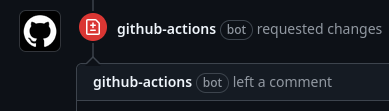
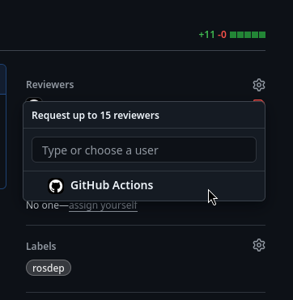

# rosdistro-reviewer

[](https://github.com/ros-infrastructure/rosdistro-reviewer/actions/workflows/ci.yaml?query=branch%3Amain+event%3Apush)
[](https://app.codecov.io/gh/ros-infrastructure/rosdistro-reviewer/branch/main)
[](https://pypi.org/project/rosdistro-reviewer/)

_Automation for analyzing changes to the rosdep database and rosdistro index_

The rosdistro index and rosdep database hold a significant amount of semi-manually curated information about various types of packages and how they are associated. To facilitate maintenance of this data and discourage modifications which might introduce unexpected behavior for users, robust automation is needed to validate proposed changes.

This tool analyzes a git repository containing changes to the rosdistro index and/or rosdep database and provides specific and actionable feedback. It is also capable of posting that feedback directly to a content forge like GitHub as a pull request review.

## Invoking rosdistro-reviewer locally

Nearly all of the validation that rosdistro-review does can be performed locally. To run the analysis, just run `rosdistro-reviewer` from anywhere in the git repository you'd like to check. By default, the tool will only analyze uncommitted changes against the most recent commit. If you've already committed your changes and you'd still like to check them, you can choose a different target ref with the `--target-ref` option. For example:
```
$ rosdistro-reviewer --target-ref origin/master

  ✅ No changes recommended
 /————————————————————————————————————————————————————————————————————————————\
 | For changes related to rosdep:                                             |
 | * ✅ New rosdep keys are named appropriately                               |
 |                                                                            |
 | For changes related to yamllint:                                           |
 | * ✅ All new lines of YAML pass linter checks                              |
 \————————————————————————————————————————————————————————————————————————————/
```

## Running rosdistro-reviewer in GitHub Actions

When a [rosdistro](https://github.com/ros/rosdistro) pull request is opened on GitHub which contains changes that this tool can process, it is invoked using GitHub Actions and the resulting analysis is posted to the pull request as a review by the user `github-actions[bot]`. The rosdistro review team uses the information presented by this review to determine if proposed commits require changes before merging.

|  |
|-|

Unlike typical pull request automation, a new review will not be generated when new changes are pushed to the pull request branch. When you feel that you've sufficiently addressed the feedback given in a previous review, you should re-request review from "GitHub Actions" and a fresh analysis will be performed.

|  |
|-|
